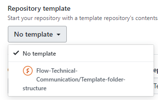
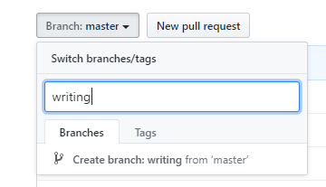

---
authorinformation:
  - null
  - Pieterjan Vandenweghe
keyword: GitHub
---

# Creating a new Git project

You need to have your personal GitHub account and be part of the Flow Technical Communication team on GitHub to create a new repository.

In this topic you create a new GitHub repository for DITA projects based on the DITA custom framework from Flow bv.

1. Go to the Flow bv [GitHub team page](https://github.com/Flow-Technical-Communication/).
2. Click the **New** button.
3. Choose Flow-Technical-Communication/Template-folder-structure as **Repository template**.

   

4. Give a proper name to your repository in the **Repository name** input field.

   We use the customer name as repository name.

   

5. Optionally add a description.
6. Tick the **Private** button.
7. Click **Create repository.**

   Your new repository is created and opened.

8. Create a new branch in the new repository by clicking on **Branch:master** and adding writing in the input field. Click the **Enter** button to confirm.

   

You created a new private GitHub repository which is only accessible for the Flow team members with a branch to start writing.

Personalize the general settings in the folder structure and Oxygen XML custom framework.

