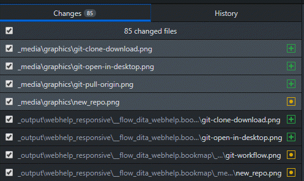
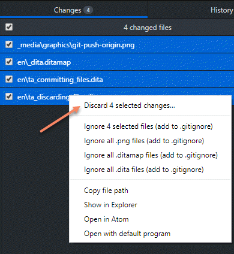
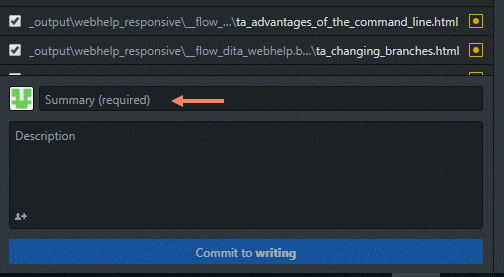

---
authorinformation:
  - null
  - Pieterjan Vandenweghe
keyword: null
---

# Pushing local changes to the cloud

All the changes you make in your local copy of the repository are visualized in the pane on the left side of GitHub Desktop.



Next to file name you find a couple of icons:

* 

  This is a new file in the repository.

* 

  This is an updated file in the repository.

* 

  This is a deleted file compared to the previous stage.

* 

  These are stashed files.

Once you have the overview of all your changes, the process to synchronize local changes to the cloud includes of couple of steps:

1. You discard the files you don't want to upload.
2. You select the files you want to upload and commit them with a summary.
3. You push the committed files to the cloud.

## Discarding files

You don't always want to push all the files to the repository in the cloud because you made some temporary test changes or some temporary folders in general.

1. Select the files you want to discard.
2. Right-click and choose **Discard selected changes**.

   

This version of the files are removed from your local branch and stored in the recycle bin on your computer.

## Committing and pushing files to the cloud

This procedure assumes you selected the correct branch to be updated.

1. Select the files you want to commit.

   By default all files are selected. You can untick the button in the upper left corner to deselect all files.

   

2. Do one of the following:

   ```text
   |**You select all files or more than one file**|Proceed to step [3](co_pushing_local_changes_to_the_cloud.html#step_ivb_pp2_flb).|
   ```

   \|**You select one file only**\|A standard summary is added which can be changed if you want to.\|

3. Add a summary in the **Summary \(required\)** field.

   

4. Optionally a description in the **Description** field.
5. Choose **Commit to** branch name.

   Your files are committed, but not yet synchronized to the cloud.

6. Choose **Push origin** to synchronize the files to the cloud.

   

You pushed all committed files to the cloud.

