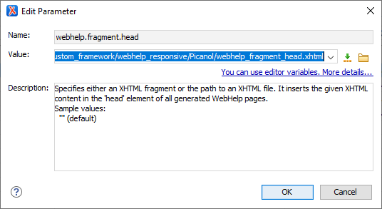

# Adding extra info to the head of HTML pages

You can inject extra info to the head of each HTML page in the webhelp responsive. This could be:

* References to additional CSS.
* An inline script.
* Reference to JAVASCRIPT files.
* A script for Google Analytics.

Follow this process to add the extra resources to the webhelp:

1. [Creating a valid XHTML file with the extra head information](./)
2. [Linking the XHTML file to the DITA-OT parameter](./)

## Creating a valid XHTML file with the extra head information

1. Create a new XHTML file.
2. Add an opening and closing `html` element.
3. Add the extra info to be added inside the `html` elements.

   Use the variable `${oxygen-webhelp-output-dir}` to link to the main folder of your responsive webhelp. For example, when your linked file is stored in the subfolder oxygen-webhelp/template/resources/js/language\_selector.js in the final output, you add this link to the file: `src="${oxygen-webhelp-output-dir}/oxygen-webhelp/template/resources/js/language_selector.js"`

   **Note:**

   In the case you add an inline script to the head and you use special characters like `&` and `<`, you need to place the content of the script between an XML comment.

4. Save the file.

   You can inject info in several elements in the HTML pages resulting in many XHTML files. To keep overview of all files, you can give the file the same name as the linked DITA-OT parameter. The DITA-OT parameter to add info to the head in the D**ITA Map WebHelp Responsive** transformation scenario is webhelp.fragment.head, so you can save the file as webhelp.fragment.head.xhtml.

```text
<html>
<meta http-equiv="X-UA-Compatible" content="IE=edge" />
<script type="text/javascript" src="${oxygen-webhelp-output-dir}/oxygen-webhelp/template/resources/js/language_selector.js" charset="utf-8"></script>
<script type="text/javascript" src="${oxygen-webhelp-output-dir}/oxygen-webhelp/template/resources/js/images.js" charset="utf-8"></script>
</html>
```

When the XHTML file is created, you need to link it to the correct parameter in your transformation scenario: [Linking the XHTML file to the DITA-OT parameter](./)

## Linking the XHTML file to the DITA-OT parameter

You can add custom the head information by linking it to the correct DITA-OT parameter when you create a transformation scenario for your publication.

1. Open any DITAMAP file in Oxygen XML.
2. Choose **DITA Maps** &gt; **Configure Transformation Scenario\(s\)...**
3. Select your **DITA Map WebHelp Responsive** transformation scenario and choose **Edit**.
4. Open the tab **Parameters** and search for the parameter webhelp.fragment.head.
5. Choose **Edit** and add a link to the custom XHTML file.

   

6. Choose **OK** &gt; **OK** &gt; **Save and close**.

