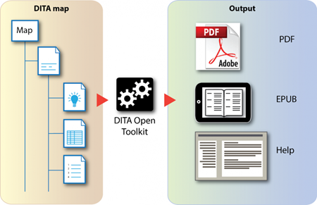

---
authorinformation:
  - null
  - Kimberley.De.Moor
keyword: null
---

# What does the DITA Open Toolkit \(OT\) do

## What it does

The main goal of the DITA OT is transforming DITA content \(maps and topics\) into output formats such as PDF, XHTML, Help formats… This is often done by using a DITA editor such as Oxygen XML which has already integrated the OT into its programming.

All transformations require a base XML document \(like what you see in the Oxygen XML Text view\). This document is then transformed according to an XSL stylesheet, which contains your information and describes how it needs to be displayed. To this end, an XSL consists of three parts:

* XSL-T \(XSL Transformations\): a language for transforming XML documents
* XML-Path \(Path Language\): an expression language used by XSL-T to access or refer parts of an XML document
* XSL-FO \(XSL Formatting Objects\): an XML vocabulary for specifying formatting semantics

## What it doesn't do

As the DITA OT is a free, open-source engine, it will not instantly give you a usable end product. More specifically, when you generate a PDF from the OT, the PDF will display a very basic layout of low to medium quality. In order to change this into high-quality material, you need to customize the OT as well as engage in some XSL-FO development work.

**Related information**

