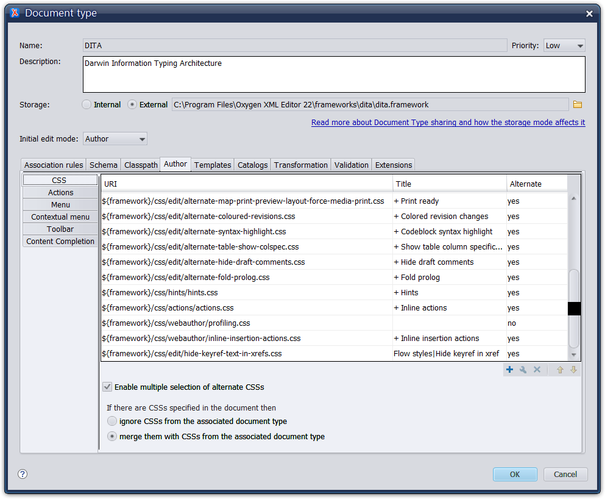
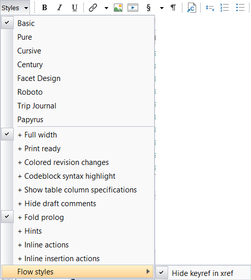

# Hiding the keyref attribute to make xrefs better legible

Keyrefs are very handy, but if you insert a cross-reference to a key, Oxygen XML will also display the `@keys` attribute value text \[**A**\] before the actual display text of the cross-reference \[**B**\].


This makes the text a bit hard to read. Therefore, you may want to hide this `@keys` attribute value text. You can do so by using a small CSS file and adding it to your Oxygen preferences.

1. Choose **File** &gt; **New** and type css in the filter box to create a new CSS file.
2. Copy the code below and paste it into your CSS file.

   ```text
     /*[Yves] Hide keyref attribute text to make the text in xrefs better legible*/
     *[keyref]:before,
     *[keyref][href]:before{
          /*Use concat to cast from URI to string*/
         link: oxy_concat("", attr(keyref, keyref));
         content: url("../../img/link_keyref.png");
         text-decoration: none;
     }
   ```

3. Save the CSS file in this folder: C:\Program Files\Oxygen XML Editor 22\frameworks\dita\css\edit
4. Choose **Options** &gt; **Preferences** .
5. Select **Document Type Association**.
6. Select the **DITA** document type and click **Edit**.
7. Click the **Author** tab and then select **CSS** in the left panel.

   

8. Click the plus button .
9. Select your CSS file and, in the **Title** box, fill a clear, descriptive name for your CSS style.

   **Tip:** This name will become a menu item in the **Styles** menu. You may want to organize your own CSS styles in a subcategory named **Flow styles**, as shown in the example below.

   

10. Click **OK** **OK** **OK** ;-\).
11. You can now select your CSS in the **Styles** menu to hide the `@keyref` attribute value text in your topics.

