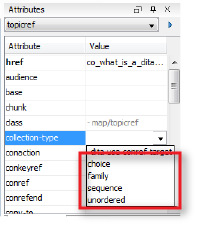

---
authorinformation:
  - null
  - Kimberley.De.Moor
category: User Guide
keyword: null
---

# Add collection-type links

A `@collection-type` attribute defines a relationship among nested topics and affects the way in which automatic links are generated in the output of your DITA map.

## Elements to which you can apply the `@collection-type` attribute

You create a collection of links by setting the value of the `@collection-type` attribute, which defines how the nested topics are test. You can apply the `@collection-type` attribute to:

* `topicref` elements in a DITA map.

  **Note:** These have to be the parent `topicref` elements in the hierarchy.

* `topicgroup` elements in a relationship table.
* Columns in relationship tables.

**Note:**

Although `@collection-type` attributes are valid in relationship table `relcell` elements, some don’t make a lot of sense in that context.

For example, if you set a `@collection-type` attribute in a relationship table cell to sequence, it will result in a **Next Topic** link in the output linking to the next topic referenced in the cell, rather than to the next topic in the TOC sequence \(as may logically be expected by the reader\).

## Possible values of the `@collection-type` attribute

You can set the values of the `@collection-type` attribute to one of the four following values:

| Value of `@collection-type` attribute | Description |
| :--- | :--- |
| choice | Not commonly used, but it is intended for situations where the reader needs to select one child topic to proceed. This may be useful when the output document is an interactive decision-support application. Most processors treat choice in the same way as unordered. |
| family | Links are generated from parent to children, from children to parent, and from sibling to sibling. |
| sequence | Links are generated from parent to children, from children to parent, and from child to previous sibling \(if applicable\) and next sibling \(if applicable\). It creates a numbered sequence. |
| unordered | Links are generated from parent to children, and from children to parent. These links can be completed in any order. |

The following table can help you decide which type is most appropriate for your situation:

| Question | Value |
| :--- | :--- |
| Should the nested task topics be completed in a particular order? | sequence |
| Do the topics represent choices? | choice or family |
| Can the task topics be done in any order? | unordered or family |
| Are the topics closely related and need links between sibling topics? | family |

