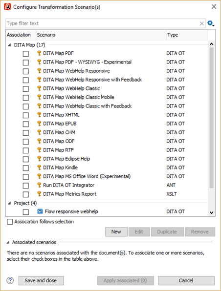

---
authorinformation:
  - null
  - Kimberley.De.Moor
category: User Guide
keyword: null
---

# Publishing DITA content in Oxygen XML

The Oxygen XML editors work with a build-in version of the DITA-OT. This is the standard DITA Open Toolkit completed with extra Oxygen XML plug-ins and patches. You can add custom plug-ins to the build-in version of DITA-OT at any time, but you will have to repeat this each time you install a new version of your editor.

You can also work with your own version of the DITA-OT when you change the standard preferences in Oxygen XML. Working your own version of the DITA-OT is useful when you collaborate and want to be sure that everyone works with the same version of the DITA-OT and the plug-ins.

**Related information**

## Using custom DITA-OT in Oxygen XML

1. In Oxygen XML, choose **Options** &gt; **Preferences**.
2. Go to the **DITA** page.
3. Choose **Custom** in the **DITA Open Toolkit** section.
4. Add the link to the correct DITA-OT.
5. Click **Apply** &gt; **OK**.

## Publishing your DITA content with DITA-OT

1. Click .

   The Configure transformation scenario\(s\) window opens.

   

2. Select all transformations you want to associate with the Oxygen XML project and click **Apply associated**.

   The chosen transformations will be applied to the current project.

