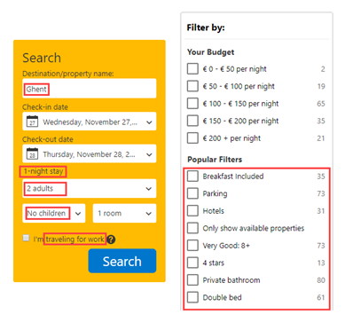

---
authorinformation:
  - null
  - Kimberley.De.Moor
category: User Guide
keyword: null
---

# What is a DITAVAL file

A DITAVAL file \(or a "conditional processing profile"[1](co_what_is_a_ditaval_file.md#fntarg_1)\) is used to filter your DITA content depending on the type of:

* audience that your content is addressing: e.g. a novice audience, an expert audience ...
* product that your content is about: e.g. iPhone X, iPhone 11, iPhone 11 Pro ...
* platform that your audience is working with: e.g. iOS 12.4, iOS 13 ...
* ...

## Example of a DITAVAL file in Oxygen XML

Within the DITAVAL file, you establish rules to include, exclude or flag DITA content that has been attributed a particular value.

This is what a DITAVAL file might look like:

* in the **text** view of Oxygen XML:

  ```text
  <val>
      <prop action="exclude" att="audience" val="novice"/>
      <prop action="flag" att="audience" val="general"/>
  </val>
  ```

* in the **Author** view of Oxygen XML:

  

The `@action` attribute determines what should happen with the various attribute values of the `@audience` attribute. In this case, the DITAVAL file will exclude all content, that is applicable to a novice audience, from the published output \(in other words: all topics or elements that are attributed the attribute value `@novice` for the `@audience` attribute are exluded from the publication.\). On the other hand, all topics or elements that are connected to the `@general` audience are not only included, but also highlighted in the publication.

## Four possible actions of the DITAVAL file

A DITAVAL file defines four different conditional processing actions in an `@action` attribute:

| Value of `@action` attribute | Description |
| :--- | :--- |
| Include | This action will include the content in the output. |
| Exclude | This action will exclude \(filter\) the content from the output. |
| Flag | This action will include and highlight the content in the output. |
| Passthrough | This action will: |

* include the content in the output
* preserve the attribute value as part of the output stream for further processing within the \(dynamic\) output.

  In other words, the conditional processing \(or filtering\) does not take place during the publishing phase of the DITA content. Instead, the various types of content and their corresponding attribute values are passed on to the output itself, which is where the filtering will take place.

**Note:** Take for example a search engine with filtering options. A customer of Booking.com will be able to efficiently search through the many possible accommodations that the site offers by using "filters," which are essentially attribute values that have been attributed to the various types of content:



\|

[2](co_what_is_a_ditaval_file.md#fntarg_2)

## Applying the DITAVAL file to your DITA map

[1](co_what_is_a_ditaval_file.md#fnsrc_1) [https://www.oxygenxml.com/dita/1.3/specs/langRef/containers/ditaval-elements.html](https://www.oxygenxml.com/dita/1.3/specs/langRef/containers/ditaval-elements.html)[2](co_what_is_a_ditaval_file.md#fnsrc_2) Source: [https://www.webworks.com/Documentation/Reverb/index.html\#page/Preparing%20and%20Publishing%20Content/Preparing%20DITA%20Files.3.07.htm](https://www.webworks.com/Documentation/Reverb/index.html#page/Preparing%20and%20Publishing%20Content/Preparing%20DITA%20Files.3.07.htm)

