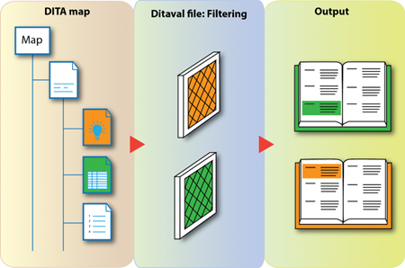

---
authorinformation:
  - null
  - Kimberley.De.Moor
category: User Guide
keyword: null
---

# What is conditional processing

## Definition

Conditional processing is a method through which content can be included, excluded or highlighted in the output, allowing you to create different outputs from a single source file.

In essence, conditional processing is a form of [content re-use](../to_different_levels_of_content_re_use/). However, rather than using one item of information \(through a conref\) in different files, you contain everything in one file and filter out what you don’t need. It is at its most useful when you write nearly identical information for very similar products, so you do not need to write and maintain separate but highly similar manuals. Conditional processing allows you to write just one manual which contains everything, and then highlights or filters out the necessary information during the publishing process.

Highlighting and filtering content is done by applying attributes to the information that differs per product/model. These attributes can then be used to:

* Highlight the content as only being valid for a certain version or model \(for example: information that only applies for Windows or Mac\).
* Filter out that content when output is being generated.

