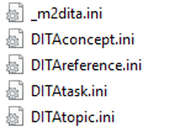
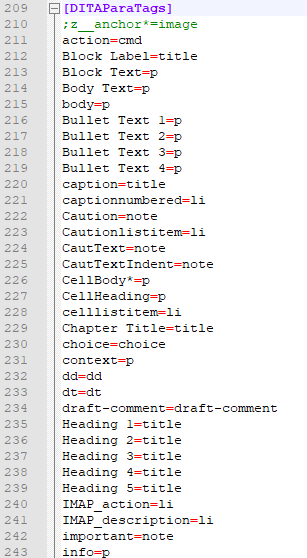

---
authorinformation:
  - null
  - null
category: null
---

# Convert MIF file to DITA using FrameMaker 11

1. Create a new folder in the 02\_conversion folder.

   Example of folder name: sgmas\_ug \(user guide of the Singapore MAS documentation\)

2. Go to the 02\_conversion folder of a manual that has previously been converted, and copy the 5 INI files within this folder to the folder you have just created.

   

   **Note:** If you open the \_m2dita.ini file, you can see how the Word styles have been mapped onto the various DITA elements.

   

3. Open FrameMaker 11.
4. Select **File** &gt; **Open …**, select the recently created MIF file and choose **Open**.
5. Select **File** &gt; **Set Up Mif2Go Export…**.
6. In the Choose Project window that opens:
   1. Adjust the **Name** so it is not too long or complicated.
   2. In the **Path** text field: select the path of the folder that you have just created within the 02\_conversion folder \(the sgmas\_ug folder in this case\).
   3. In the **Format** text field: select **DITA**.
   4. Select **OK**.

      
7. Select **File** &gt; **Save Using Mif2Go…**.
8. Select **OK** twice.

   The MIF file will be converted to DITA and all DITA and DITAMAP files will be saved in the sgmas\_ug folder.

