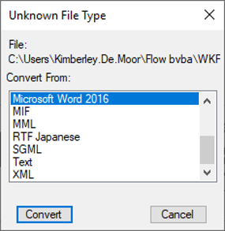

---
authorinformation:
  - null
  - null
category: null
keyword: null
---

# Convert Word DOCX file to MIF file using FrameMaker 19

Clean up the Word DOCX file by creating and attributing new Styles to the content. These styles should correspond to the DITA elements that you want to attribute to the content.

**Note:** For example: create a "step" Style to replace the numbered list items in a section that is to be converted to a task topic.

1. Copy your prepped DOCX file \(that you saved in the 01\_preparation\_conversion folder\) to the 02\_conversion folder.
2. Open FrameMaker 19 and select **File** &gt; **Open...**.
3. In the pop-up window that appears, select the DOCX file \( in the 02\_conversion folder\) and choose **Open**.

   **Note:** Make sure to select **All Files \(\*.\*\)** in the bottom right corner.

4. Select **Microsoft Word 2016** in the Unknown File Type window that appears and choose **Convert**.

   

5. Double-check all the styles used in FrameMaker via plugins \(Chartools, Paratools\).

   **Note:** Make sure there are no blank lines between the title of a topic and a table. This causes problems during the conversion process.

6. Delete everything \(images, blank lines…\) that precedes the main title of the document.
7. Open the **Paragraph Designer** \(Shortcut: **CTRL** + **M**\).
8. Place your cursor in the main title of the document and type document title in the **Style** text field of the Paragraph Designer window.
9. Select **Create Style**.
10. Select **File** &gt; **Save As …**.
11. In the **Save as type** text field, select **MIF 2019 \(\*.mif\)** and save the MIF file in the 02\_conversion folder.

    **Note:** If you close FrameMaker 19, you can choose to save the FM file in the 02\_conversion folder as well.

