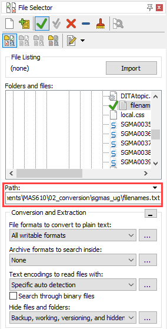
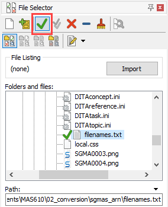
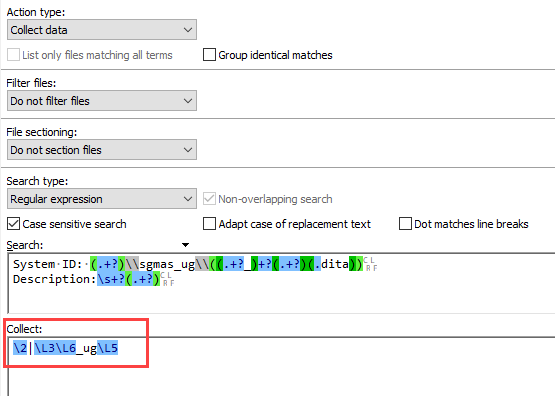
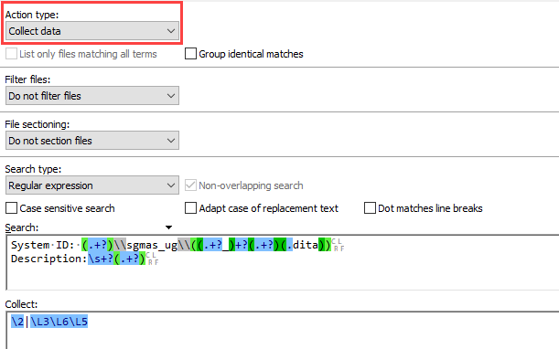
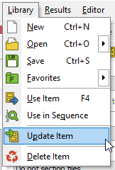
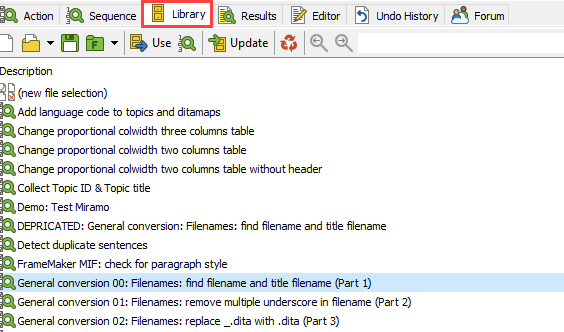
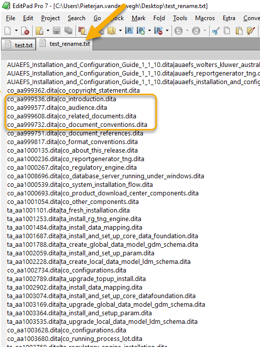
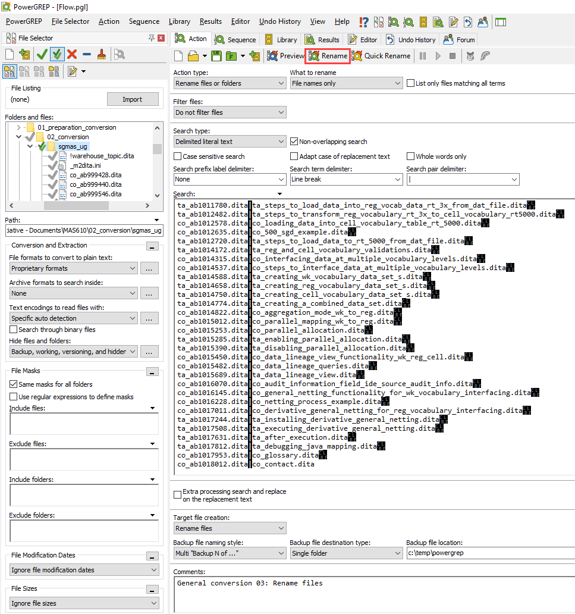
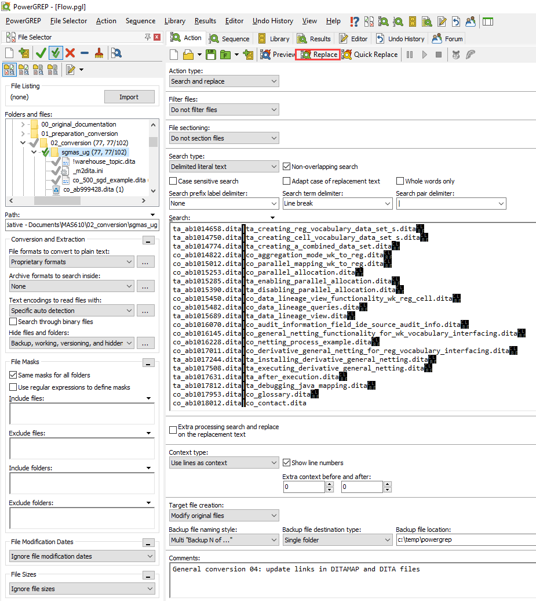
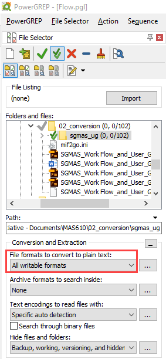

---
authorinformation:
  - null
  - null
category: null
keyword: null
---

# Adjusting the DITA file names

## Collect file names and titles in OxygenXML

After conversion via Mif2Go, the files have a unique file name which is not easy to read. This procedure explains how to change the file name to the file title.

1. Open Xpath/Xquery builder in OxygenXML.
2. Set the scope to **Current DITA map hierarchy**.
3. Search for `(topic|concept|task|reference)/title`.

   OxygenXML lists all topics that match this Xpath expression.

4. When you come across **class=”- topic/title “** in the list of topic titles that appear at the bottom of the screen, double-click it and remove all redundant DITA elements within the `title` element of the topic \(for example `b` elements or `ph` elements\).

   

   **Note:** Do this for all **class=”- topic/title “** items that are present in this list.

5. When you are finished, repeat step [3](./#step_lyf_p5v_xjb).
6. Right-click on one of the results and select **Save Results...**
7. Save the file as TXT.

   You need to add the file format .txt manually.

## Create a TXT file to be used for renaming

Open the Flow PowerGREP library with regular expressions. You can find the library here: S:\IT\Powergrep\Flow.pgl.

1. Select the TXT file by copying its path in File Explorer and pasting it into the **Path:** text field in the File Selector pane.

   

2. Click on your TXT file under **Folders and files:** and select the green check mark at the top of the **File Selector** pane.

   

   A green check mark will appear before your TXT file.

3. Open the **Library** tab and double-click **General conversion 00: Filenames: find filename and title filename \(Part 1\)**.

   The regular expression needs to be updated every time if you change the folder structure of the conversion. You need to add the last nested folder of the folder structure where your DITA files are stored.

4. Update the folder name in the first line between the `\\` in the **Search** box.

   If the DITA files are stored in C:\Flow bvba\WKFS Documentation Initiative - Documents\MAS610\02\_conversion\sgmas\_ug\, you need to add `sgmas_ug` between the `\\`

   .

   The first line in the regular expression is: `System ID: (.+?)\\sgmas_ug\\((.+?_)+?(.+?)(.dita))`

   

   **Note:**

   You might need to select the checkbox **Case sensitive search** if you are using a path that contains two different folders with the same name, but written in a different letter case.

   For example: ..\UK\03\_dita\uk.

5. Add the suffix that you want to add to each of the DITA files in the **Collect** field.

   `_ug` when you are renaming the DITA files for the user guide of a specific set of documents:

   

   **Note:** By adding the appropriate suffix to the DITA files, you will not accidentally overwrite files with the same file name across different documents.

6. Make sure that **Collect data** is selected in the **Action type:** dropdown list at the top of the user interface.

   

7. Select **Library** &gt; **Update item**.

   

8. Open the **Library** tab.

   

9. Right-click on **General conversion 00: Filenames: find filename and title filename \(Part 1\)** and select **Use in Sequence**.
10. Right-click on **General conversion 01: Filenames: remove multiple underscore in filename \(Part 2\)** and select **Use in Sequence**.
11. Right-click on **General conversion 02: Filenames: replace \_.dita with .dita \(Part 3\)** and select **Use in Sequence**.
12. Open the **Sequence** tab.

    You see the three steps to be executed.

13. Select the second step by clicking on it once \(not by checking the check box that precedes the step\) and go to **Step details** at the bottom of the user interface.
    1. Select **Target files from other steps** in the **File selection:** dropdown list.
    2. Select **1** in the **Step** dropdown list.
14. Select the third step by clicking on it once \(not by checking the check box that precedes the step\) and go to **Step details** at the bottom of the user interface.
    1. Select **Target files from other steps** in the **File selection:** dropdown list.
    2. Select **2** in the **Step** dropdown list.
15. Select **Execute**.

    

A new TXT file is saved in the same location as your original TXT file with a list of the old name and new name of the DITA files. The suffix \_rename is added to the file.

## Batch rename DITA file names

1. Select the folder with the DITA files in the File Selector pane and select the green double check mark at the top of the **File Selector** pane.

   Now you have selected the entire contents of this folder.

2. Open the **Library** tab and select **General conversion 03: Rename files**.
3. Paste the text from the final file from the procedure [Create a TXT file to be used for renaming](./) in the **Search** box.
4. Delete the red mark at the top of the contents of the **Search box**.

   

5. Select **Rename**.

   

All file names are renamed and correspond to the topic title of each DITA file.

## Update links in DITAMAP and DITA files

1. Select the folder with the DITA files in the File Selector pane and select the green double check mark at the top of the **File Selector** pane.

   Now you have selected the entire contents of this folder.

2. Open the **Library** tab and select **General conversion 04: update links in DITAMAP and DITA files**.
3. Paste the text from the final file from the procedure [Create a TXT file to be used for renaming](./) in the **Search** box and select **Replace**.

   

   **Important:** Make sure that **All writable formats** is selected in the **File formats to convert to plain text:** dropdown menu!

   

