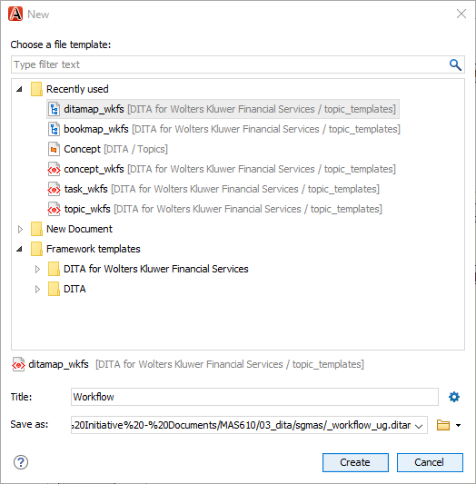

---
authorinformation:
  - null
  - null
category: null
keyword: null
---

# Create a DITAMAP for every chapter

1. Open your new bookmap in the **Dita Maps Manager**, right-click on **frontmatter** and select **Insert after** &gt; **New…**.
2. Select the ditamap template \(specific to the project you are working on\).

   If you are working on a project of Wolters Kluwer Financial Services, select the **ditamap\_wkfs** template.

3. Give your ditamap the same name as the first chapter of the document that you are converting and save it in the correct folder, that is: one folder level lower than the location where you have previously saved your bookmap.

   

   **Note:**

   * The **Title:** text field is where you should fill in the `title` of the topic, DITAMAP, … that you are creating.
   * In the **Save as:** text field you can adjust the file name.

   **Important:** Make sure to add an extra suffix to the end of the file name, e.g. \_ug when you are creating a file for the user guide of a specific set of documents. This way you will not accidentally overwrite files with the same file name across different documents.

4. Select **Create**.
5. Repeat this process for every chapter of the document that you are converting.

   **Note:** For the “Introduction” chapter, create a ditamap that includes the word “Preface” instead \(both in the file name as in the title\): e.g. \_preface\_sgmas\_user\_guide.ditamap.

   **Note:** You can delete **Chapter** in your bookmap \(in the **Dita Maps Manager**\).

