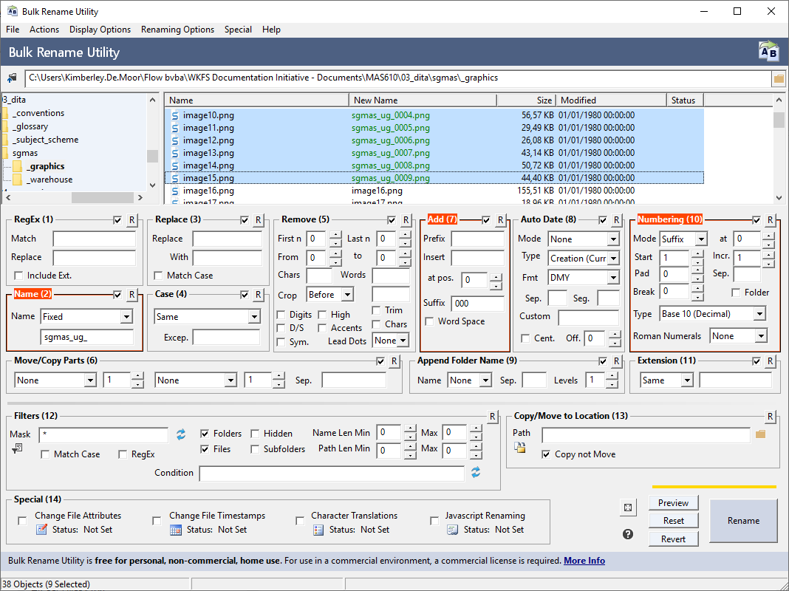
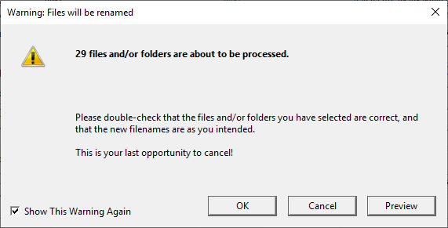
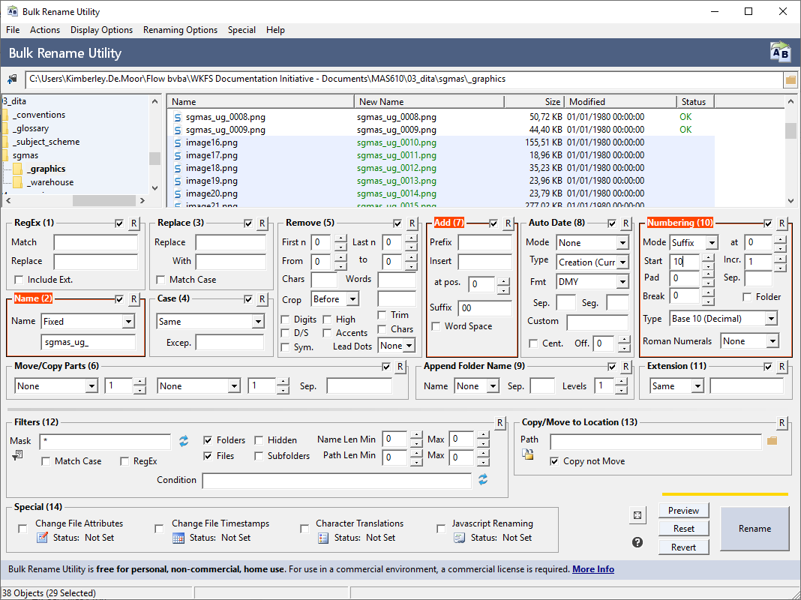

---
authorinformation:
  - null
  - null
category: null
keyword: null
---

# Rename your graphics with Bulk Rename Utility

1. Open **Bulk Rename Utility** and select the folder that contains the files or images that you want to rename \(in this case, the \_graphics folder\).
   * Copy the path to the \_graphics folder in **File Explorer** and paste it into the path field of **Bulk Rename Utility**. Press **Enter** on your keyboard.
   * Browse for the \_graphics folder in the file selection pane on the left of the user interface and select it.
   * Select the folder icon on the right of the path field and browse for the \_graphics folder in the Browse for Folder window that opens. Select **OK**.

     
2. Select the first 9 images that you want to rename in the pane that lists the contents of the \_graphics folder.

   **Note:** It is best to number the images according to the order in which they appear in the document using the following range: 0000 to 9999. You will need to divide the images that you want to rename in multiple groups:

   * the first 9 images that will be numbered as follows: 0001 - 0009 \(1 numeral preceded by 3 zeros\)
   * images 10 to 99 that will be numbered as follows: 0010-0099 \(2 numerals preceded by 2 zeros\)
   * etc.

   **Tip:** If you want to select all images, click in this pane and press **ctrl** + **A**. If you would like to exclude a file from this selection, hold **ctrl** and select the file.

3. Configure the renaming options as follows:

   1. In the **Name \(2\)** pane: select **Fixed** in the **Name** dropdown menu and type the abbreviation of the type of software and the type of document that you are currently converting \(separated by underscores\) in the text field below.

      For the user guide of the \(Singapore\) MAS software, the name of the images will start with: sgmas\_ug\_.

   2. In the **Add \(7\)** pane: type 000 in the **Suffix** text field.
   3. In the **Numbering \(10\)** pane: select **suffix** in the **Mode** dropdown menu and type 1 in the **Start** text field.

   

4. Select **Rename** and keep selecting **OK** until a message appears that your images have been succesfully renamed.

   **Note:** After you select **Rename**, you still have a chance to cancel the renaming process by selecting **Cancel** in the Warning: Files will be renamed pop-up window. To see a preview of the renaming process, select **Preview**.

   

5. Select the remaining images \(that fall within the 0010 to 0099 range\) in the pane that lists the contents of the \_graphics folder.
6. Configure the renaming options as follows:

   1. In the **Name \(2\)** pane: select **Fixed** in the **Name** dropdown menu and type the abbreviation of the type of software and the type of document that you are currently converting \(separated by underscores\) in the text field below.

      For the user guide of the \(Singapore\) MAS software, the name of the images will start with: sgmas\_ug\_.

   2. In the **Add \(7\)** pane: type 00 in the **Suffix** text field.
   3. In the **Numbering \(10\)** pane: select **suffix** in the **Mode** dropdown menu and type 10 in the **Start** text field.

   

7. Select **Rename** and keep selecting **OK** until a message appears that your images have been succesfully renamed.

