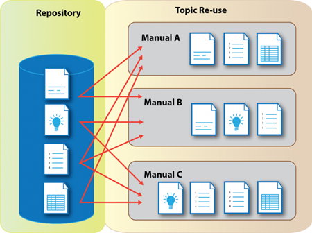

---
authorinformation:
  - null
  - Kimberley.De.Moor
keyword: null
---

# Re-using topics

Re-using topics is a very good way of making efficient use of your content. When you write your content according to the best-practice suggestions, your topics will be clear and self-contained, meaning they can easily be re-used elsewhere and still make sense.

The main way to re-use a topic is by inserting it into multiple DITA maps. This way you essentially have a single repository of topics, and you link the ones you need in the relevant DITA map\(s\).

There are types of topics that respond very well to being re-used like this, for instance:

* Topics that contain standard text, such as legal information.
* Topics with a recurring information set, such as a procedure that must be done in multiple task flows or scenarios.
* Topics that need to appear in different sets of information. For example, when you need to add the same topic to a help system and to a PDF file for a user guide.

**Tip:**

If you have a similar topic but with content that needs to be customized, you can create a DITA template instead. Writers can re-use that template to make similarly structured topics but with unique content.

**Note:**

Using the same topic several times in the same DITA map can create problems when generating output \(all links to the topic will point to the first instance of the topic\).

If you need the same topic to appear several times in the same map, you should use the `@copy-to` attribute. You enter a new filename in the `@copy-to` attribute of the `topicref` element. In this way, you create duplicate topic references in the DITA map without actually creating additional topics in the source files. You can then use the `linktext` and `shortdesc` elements in the `topicmeta` element of the topic reference to provide a unique title and short description to help you distinguish between the two in link previews.

