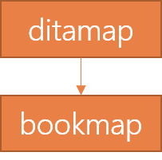

---
authorinformation:
  - null
  - Kimberley.De.Moor
category: User Guide
keyword: null
---

# What is a bookmap

## Definition

A bookmap is a specialization of a [DITA map](co_what_is_a_dita_map/) and is meant to be used when you intend to publish your documents in a book format. It contains structure and metadata, but no content. It is especially designed to create output in book-style formation and therefore includes the following major structures:

* title
* bookmeta \(owners, authors, publishing data,…\)
* front matter \(acknowledgments, definitions, abbreviations,…\)
* chapters and parts
* appendix topics
* back matter \(index, notices, lists,…\)
* relationship tables

## Purpose of a bookmap

A bookmap is best suited for when you specifically want to create output in the traditional form of a book. Its template allows you to organize your content in a book format by adding, among others, chapters, parts and appendixes.

**Note:** Bookmaps are not suited for output formats other than traditional book formats. If you are planning different types of output, you should consider using a regular DITA map and including book metadata by using the elements and attributes in the `topicmeta` element.

You use DITA to publish a research paper, so you write your information in a bookmap and add the necessary chapters. You can now make use of, for instance, the frontmatter to add a cover and the backmatter for glossaries.

