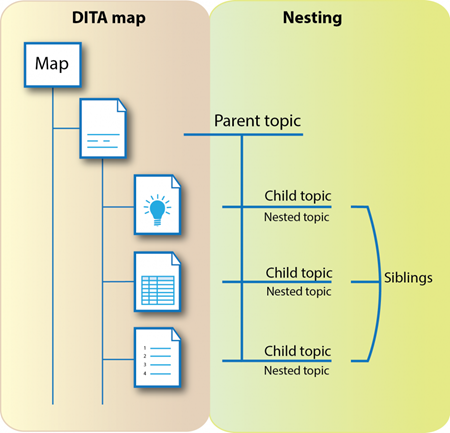
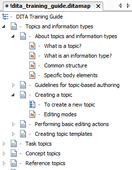

---
authorinformation:
  - null
  - Kimberley.De.Moor
category: User Guide
keyword: null
---

# What is a DITA map

A DITA map is a collection of [topics](../../../co_structured_authoring/co_what_is_a_topic.md) assembled into a sequence and hierarchy.

## Description

DITA maps are files with the extension .ditamap. Unlike topics, DITA maps shouldn’t contain any content of their own. Instead, they contain references to the content and provide a structure for these references. In this sense, you can best compare a DITA map to an outline that describes the hierarchy and the order of its topics.

## Hierarchy and nesting

DITA maps contain the structure of your topic references. This structure resembles a table of contents and helps your reader locate the required information. To create a meaningful structure, you can group relevant topics together and nest them under a topic grouping or a . The head topic is referred to as the ‘parent topic’ and the nested topics underneath it as its ‘child topics’. The relationship between the child topics is defined as ‘siblings’.

Here you can see the table-of-contents-like structure of a DITA map created by the nested topics:

**Related information**

