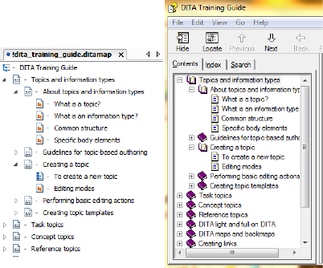

---
authorinformation:
  - null
  - Kimberley.De.Moor
category: User Guide
keyword: null
---

# Purposes and advantages of DITA maps

As a DITA map defines the relationships between its topics, it forms the basis for navigating and linking content. A well-organized DITA map allows you to quickly find the topics you need.

## Main purposes

Concretely, you use a DITA map structure to:

* Collect topics you want to appear in your output.
* Organize the topics in a manageable structure that is easy to navigate - both for you and your reader.
* Define the relationship between topics and correctly link them.

## Easy collection of topics and simple creation of topic structure

In essence, the topics you write are loose files that you can gather in a DITA map. You enter a topic into your DITA map by adding a reference to that topic - a link. As such, when you delete a topic from the list, you do not delete the actual file but only its reference within the map. This makes adding, reorganizing or deleting topics an easy task. For instance, when a particular topic is no longer useful for the product you write about \(the new model no longer carries a particular function\), you can delete its reference from the map. When later the function is relevant again, you can just re-add the topic reference, as you never deleted the actual topic file in the first place.

The newest model of a photo camera no longer supports the option to add color filters while you take pictures, so you remove the topicrefs about color filters from the DITA structure. The new manual for the camera no longer contains these topics, but you keep the original topic files in case a future camera model does have filters.

## DITA hierarchy in output

In the DITA map, you organize your topics in a usable structure. When you generate output, this structure is used to organize your content and your table of contents. Nothing actually changes on the topic-level of your content. You do not need to start numbering or changing the titles of topics to reflect their position within the DITA map. This structure is automatically generated and numbered \(if applicable\) while output is being generated. Of course, how exactly it appears in the output depends entirely on the type of format you are generating and \(if applicable\) on the template you use.

The table of contents of this webhelp file follows the DITA map structure of the original document:

Additionally, when you later want to change the order of your topics, promote or demote them, the structure will automatically change when you generate output once more. This makes structuring and re-using topics an easy task where you do not need to manually change every title according to its new position, nor adjust the table of contents afterward.

## Relationship table

The DITA map is a hierarchy of links to your topics. If you add a relationship table to the DITA map, you can also create links that go beyond the hierarchical structure. As such, most of your linking is centralized and easy to navigate in one file. This makes it easier to glance over the entire structure and establish which relationships exist and how they might need to be adjusted.

