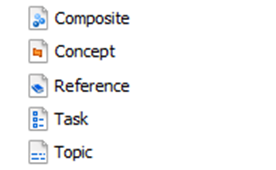

---
authorinformation:
  - null
  - Kimberley.De.Moor
category: User Guide
keyword: null
---

# What is an information type

DITA distinguishes different types of topics, each intended for a particular type of information. These topic types are therefore also called information types. A well-written topic includes only one type of information.

The three core information types in DITA are the following:

| Information type | Description |
| :--- | :--- |
| **Task** | Task topics include the steps of a particular task or procedure. They answer the question “How to…?”. |
| **Concept** | Concept topics include background information that users must know \(e.g. definitions, examples…\) before executing a particular task or procedure. They answer the question “What is…?” or "What does a certain term mean?". |
| **Reference** | Reference topics provide quick access to reference information that is relevant to the subject at hand. Reference information is often presented as a list or a table \(e.g. an overview of error codes, a bibliography…\). |

Generic topics \(**topic**\) and **composite** topics should only be used for specific purposes:

| Information type | Description |
| :--- | :--- |
| **Topic** | Generic topics are designed as a starting point for specialization. We use them, however, to create title-only topics \([stub topics](../co_xml_editors/co_oxygen_xml/to_guidelines_and_tips_oxygen_xml/co_guidelines_for_creating_dita_maps_and_bookmaps.md#section_k11_cf4_sjb)\) when composing a DITA map. |
| **Composite** | Composite topics can include task, concept and reference elements. You can only use these topics to create [conref](../to_different_levels_of_content_re_use/co_using_conrefs.md) libraries, not to create topics with mixed content. |

Technical writers split up texts depending on the kind of information they want to present to the reader. By using information types to filter and structure the information, the reader will no longer have to spend energy on this when reading the text.

The components in an information type and their structure and hierarchy are defined in the information model the writer uses.

