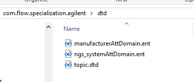

---
authorinformation:
  - null
  - Pieterjan Vandenweghe
keyword: null
---

# Declaring the attribute in your content type

Unzip the DITA-OT plug-in you created in the procedure [Creating extra conditional filtering attributes](ta_creating_a_specialization_with_extra_conditional_filtering_attributes.md) and open it in a separate Windows Explorer window.

In this procedure you connect the newly created attributes to the content type.

As an example I will connect the `@ngs_system` attribute to the topic.dtd.

1. Go to your DITA-OT plug-in folder and open the org.oasis-open.dita.v1\_3 plug-in.
2. Go to the subfolder dtd\technicalContent\dtd and copy the DTD of the content type you want to update.

   In our case this is topic.dtd.

3. Open the DITA plug-in you created in the procedure [Creating extra conditional filtering attributes](ta_creating_a_specialization_with_extra_conditional_filtering_attributes.md) and paste the DTD file in the subfolder dtd.

   

4. Open the file topic.dtd.
5. Search for DOMAIN ATTRIBUTES DECLARATIONS.
6. Declare the attribute as follows:

   1. Start with `<!ENTITY %` and add the name of the attribute `ngs_system` and end with `Att-d-dec`.

      **Note:** Make sure to add a space after the `%` symbol.

      `<!ENTITY % ngs_systemAtt-d-dec`

   2. Add the public identifier of your attribute.

      You can find this in the ENT file you create in procedure [Creating extra conditional filtering attributes](ta_creating_a_specialization_with_extra_conditional_filtering_attributes.md).

      In our case this is the file ngs\_systemAttDomain.ent in which we find `PUBLIC "-//Flow BV//ENTITIES DITA Ngs_system Attribute Domain//EN"`.

   3. Add the file name where the attribute is defined between quotation marks and add a `>` to close the piece of code.

      `"ngs_systemAttDomain.ent">`

   4. Add the symbol `%` followed by the name of the attribute `ngs_system` and end with `Att-d-dec;`

      **Note:** Do NOT add a space after the % symbol.

      `%ngs_systemAtt-d-dec;`

   ```text
   <!ENTITY % ngs_systemAtt-d-dec
   PUBLIC "-//Flow BV//ENTITIES DITA Ngs_system Attribute Domain//EN"
            "ngs_systemAttDomain.ent"
   >
   %ngs_systemAtt-d-dec;
   ```

