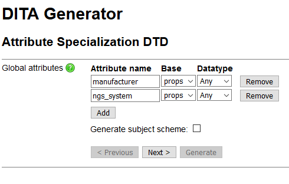

---
authorinformation:
  - null
  - Pieterjan Vandenweghe
keyword: null
---

# Creating extra conditional filtering attributes

In this topic you create a DITA-OT plug-in that extends the number of conditional filtering attributes. We use the `@props` attribute as the master attribute for newly created attributes.

1. Go to [https://dita-generator-hrd.appspot.com/attribute/](https://dita-generator-hrd.appspot.com/attribute/).
2. Click **Add** to the attributes in the **Attribute name** input field.

   Double check if the **Base** and the **Datatype** input field are correct:

   | Input field | value |
   | :--- | :--- |
   | **Base** | props |
   | **Datatype** | Any |

   

3. Optionally tick the button to generate a subject scheme.
4. Click **Next**.
5. Complete all input fields on the Attribute Specialization DTD page.

   | Input field | Description | Example |
   | :--- | :--- | :--- |
   | **Shel dtd ID** | Shell dtd ID is used to identify the shell dtd and the DITA-OT plug-in. | com.flow.specialization.agilent |
   | **Title** | Type title is the human readable name for the shell dtd. | DITA specialization for Agilent |
   | **Owner** | The owner information is only use for Public Formal Identifier \(FPI\) generation. | Flow BV |

   **Note:** All DITA-OT plug-ins created by Flow bv must start with `com.flow.`.

6. Click **Generate.**

   A ZIP file is created.

You created a new DITA-OT plug-in containing the extra attributes you defined in this procedure. In the ZIP file you find the following folders and files:

* plugin.xml
* integrator.xml
* catalog-dita.xml
* dtd folder containing ENT files. You find one ENT file per attribute you created.

